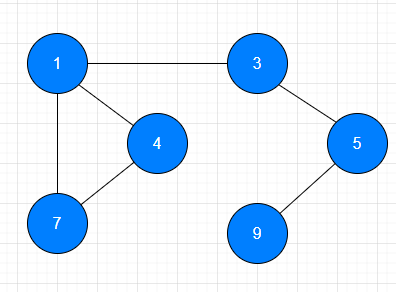

## 二叉搜索树

1. 左子树上所有的结点的值均小于根结点的值
2. 右子树上所有结点的值均大于根结点的值
3. 左右子树也一定是二叉搜索树

二叉搜索树有一个缺陷，是非常影响性能。如果根结点足够大。就是左边会变得特别长。

二叉搜索树在极端的情况下，会退化成链表，几乎是线性查找

## 红黑树

红黑树是一种平衡的二叉搜索树。说他平衡的意思：它不会变成瘸子，红黑树除了符合二叉搜素树的特性之外，还具备5个特性

1. 结点是红色或者是黑色
2. 根结点是黑色
3. 每个叶子结点都是黑色的空结点
4. 每个红色结点的两个子结点都是黑色
5. 从任意结点到每个叶子结点的所有路径都包含相同的黑色结点

正是因为这些规则，才能保证：**红黑树的平衡**

**从根结点到叶子结点的最长路径不大于最短路径的2倍**

当插入和删除结点时，就会导致红黑树的平衡被破坏，这个时候就需要对红黑树进行调整，从而使他符合5个特性，以此保证红黑树的平衡。

红黑树的平衡调整有两种方式：**变色**，**旋转**（左旋转和右旋转）

## 树的应用

1. 组织索引，MySQL中用的是B+树
2. 红黑树，JDK1.8 hashmap 

树的深度：从根结点开始，自顶向下逐层累加的。

树的高度：自底向上逐层累加

## 图

image，是一种数据结构

集合只有同属于一个集合；线性结构存在一对一的关系，树形结构一对多的关系，图形结构，多对多的关系。

微信中：许多的用户组成了一个多对多的朋友关系网，这个关系网就是数据结构当中的图（**Graph**）。

导航的最优路径：耗时最少，路程最短的路径，推荐一个方便最快捷的路线。其实就把经过的地方看作图上的一个一个的点，从起点出发，与另外的一个点或者其他的点产生了关联。

**图的概念：**

图：是一种比树更为复杂的数据结构。树结点之间是一对多的关系，并且存在着一个父与子的层级划分。多对多的关系，并且的，所有的顶点都是平等的，无所谓谁是父亲，谁是儿子。在图中，最基本的单元是顶点（vertex）;顶点相当于书中的结点，顶点之间的关系：被称为边（edge）

自环：即一条连接一个顶点和自身的边

平行边：连接同一对顶点的两条边（有可能是多条边）

**图的分类：**

按照连接的两个顶点的边的不同，可以把图分为以下几种：

1. 无向图：边没有方向的图称为无向图，边的作用仅仅是连接两个顶点，没有其他的含义
2. 有向图：边不仅连接两个顶点，并且具有方向性，可能是单向也可能是双向的
3. 带权图：边可以带权重

**图的术语：**

1. 相邻顶点：当两个顶点通过一条边相连时，我们称这两个顶点是相连的，并且是依附于这两个顶点的。

2. 度：某个顶点的度：是依附于这个顶点的边的个数

   树结点的度：结点所拥有的子树的个数

   树的度：书中结点度最大值

3. 子图：一幅图中，所有边的子集组成的图，包含这些边的依附的顶点

4. 路径：是由边顺序连接的一系列的顶点组成

5. 环：是一条至少含有一条边且终点和起点相同的路径

6. 连通图：如果图中，任意一个顶点都存在一条路径到达另外一个顶点，那么这副图我们就称之为连通图

7. 连通子图：一个非连通图由若干个连通的部分组成，每一个连通的部分就可以称为：该图的连通子图

   

1和3是相邻的，这条边依附于1和3

1顶点的度是：3

从7到9，会经过1，3，5这些顶点，这个叫做路径

1，4，7组成叫做环，从1出发，到7，到4，到1结束，起点和终点相同，称为环

## 欧拉七桥

欧拉开创了新的学科：图论

## 图的存储结构

1. 顺序存储
2. 链式存储

线性表：它仅有的关系就是线性关系

树形结构：有清晰的层次的结构

图形结构：集合中的每一个元素都有可能有关系，我们要弄清楚图的存储结构，弄清楚以后我们用代码去实现图的时候，就没有那么困难了。

图是由顶点和边构成。所以在图里边：要存储的图形结构的信息，无非就是存储图的顶点和图的边。

顶点可以直接用数组去存储

1，2，3，4=>[1,2,3,4]

A，B, C, D =>[A ,B ,C ,D]

边存储起来就比较麻烦了

**存储结构：**

1. 邻接矩阵

   矩阵是一个按照长方阵列排列的负数或者实数集合。

   N* M 数据的集合（九宫格）

   去除表格线的九宫格就是矩阵的样式。矩阵是由行和列组成的一组数表。

   邻接矩阵让每一个结点和证书相关联

   用1表示顶点与顶点有直接的关系，用0表示没有连接

   优点：表示非常的明确，有向图：A->D:1 D->A 0

   缺点：非常浪费计算机的内存。存储了太多0，

   |      | A    | B    | C    | D    | E    | F    |
   | ---- | ---- | ---- | ---- | ---- | ---- | ---- |
   | A    | 0    | 1    | 1    | 1    | 0    | 0    |
   | B    | 1    | 0    | 0    | 0    | 1    | 1    |
   | C    | 1    | 0    | 0    | 1    | 0    | 0    |
   | D    |      |      |      |      |      |      |
   | E    |      |      |      |      |      |      |
   | F    |      |      |      |      |      |      |

2. 邻接表

   邻接表：由图中的每个顶点以及和顶点相邻的顶点列表组成。数组/链表

   | A    | B、C、D |
   | ---- | ------- |
   | B    | A、E、F |
   | C    | A、D    |
   | D    | A、C    |
   | E    | B       |
   | F    | B       |

   解析：A与B、C、D 连接，B 与  A、E、F 连接。

